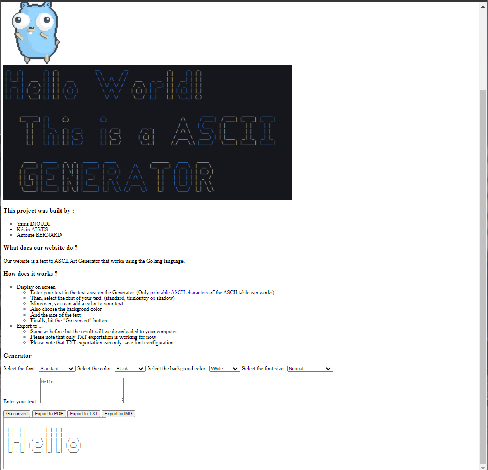
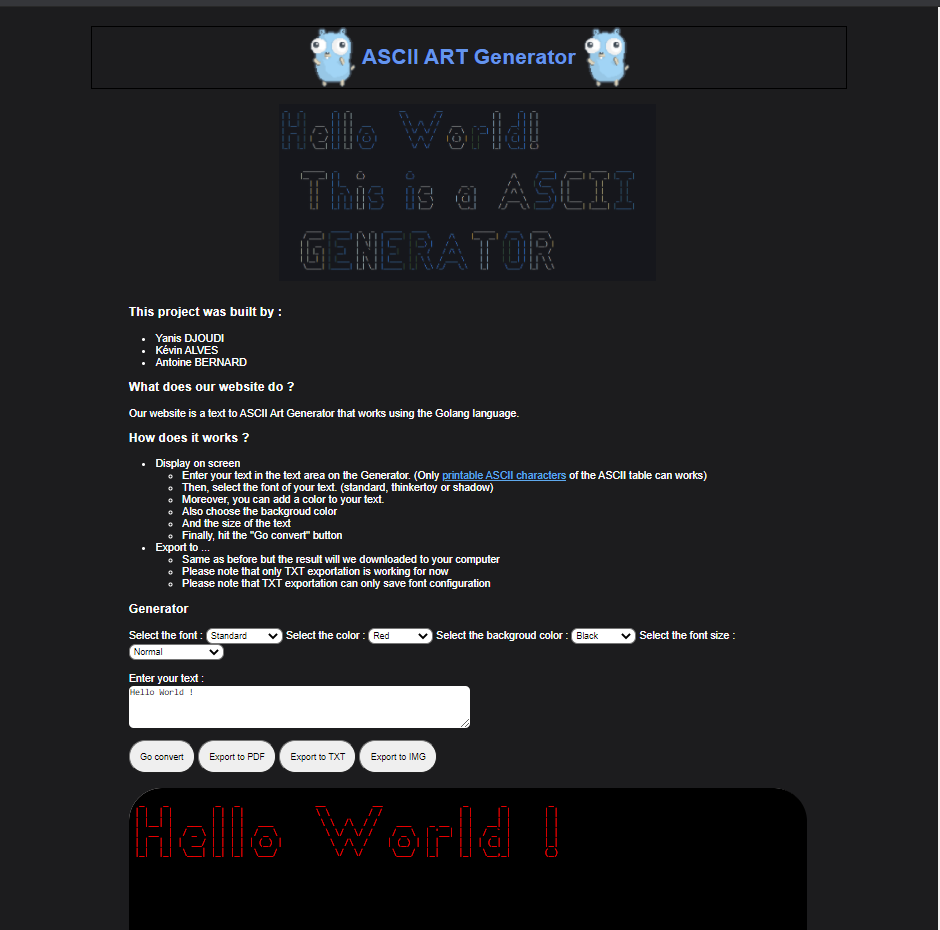
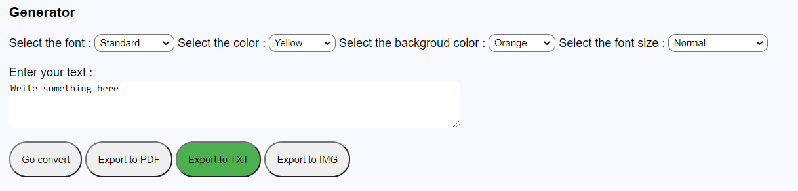

# ASCII-ART-WEB

## Objectives

_**ASCII ART WEB**_ consists in creating and running a server for outputting the text in a graphic representation of ASCII using our last project, _**ASCII ART**_ on a website.

## How to use the program ?

In order to use our program, you have to type the following on your command prompt `go run main.go`. Afterwards, the server will start and you will be invited to click on the link below that will take you to the website.

```
PS C:\VSCODEProjet\Ytrack\B1\ASCII-ART-WEB\ascii-art-web> go run main.go
Starting server at port 8080
Go on http://127.0.0.1:8080

To shutdown the server and exit the code hit "crtl+C"
```

Once you are on the website, you will be able to :
- Type your text ;
- Choose a font-style between Standard, Shadow and Thinkertoy ;
- Customize the colors of the text and the background ;
- Adjust the font size of the text.

## Result

This webpage is the result of using only HTML in our code in order to respect the instructions of the exercice.




<hr>


# ASCII-ART-STYLIZE

## Objectives

The main goal of the subproject _**STYLIZE**_ is to make our website more appealing, interactive and intuitive, using CSS.

## Result

The website is :
- Responsive ;
- Handles the user interface theme (light or dark mode)
- Appealing, interactive, "user friendly" and give more feedback.
- Respects HTML and CSS routines :
    - comments were added.
    - assets files with CSS images and separated from the HTML file.
    - code is well organized.




<hr>


# ASCII-ART-WEB-EXPORT-FILE

## Objectives

The main goal of the subproject _**EXPORT-FILE**_ is to allow the user to convert the webpage into a file using different export formats like .txt, .pdf or .png.

## How to export to different formats ?

Once you are on the website, on the bottom of the webpage you can click on different buttons that are used to convert the webpage into a file into the chosen export format




<hr>

# ASCII-ART-WEB-DOCKERIZE

## Objectives

The main goal of the subproject _**DOCKERIZE**_ is to create a Dockerfile (== an executable that contains the files and the dependencies of a program.), one image and one container

## How to do a docker ?

You have to create a Dockerfile which contains the following :

```docker
# The base go-image
FROM golang:1.15.6
 
# Create a directory for the app
RUN mkdir /ascii-web-docker
 
# Copy all files from the current directory to the app directory
COPY . /ascii-web-docker
 
# Set working directory
WORKDIR /ascii-web-docker
 
# Run command as described:
# go build will build an executable file named server in the current directory
RUN go build -o server . 
 
# Run the server executable
CMD [ "/ascii-web-docker/server" ]
```


Afterwards, in order to run the docker in the command prompt:

You have to build the program with the command :

```cmd
docker build -t ascii-web-docker .
```

Then, run it with the command :

```cmd
docker run -it --rm -p 8081:8080 ascii-web-docker
```

<hr>

# What we have learned from this Project

This project helped us learn about the topics below : 
- Client utilities.
- The basics of web :
    - Server
    - HTML/CSS
    - HTTP 
    - Linking CSS and HTML
    - The basics of human-computer interface.
- Learning about docker.
- Using and setting up Docker :
    - Services and dependencies.
    - Containerizing an application.
    - Compatibility/Dependency.
    - Creating images.
- The basics of export formats :
    - Portable Document Format (pdf)
    - Text File (txt)
    - HTTP headers
    - Ways to receive data.
    - Ways to output data.

<hr>

# This project was made by :
### Yanis (as YDJOUDI)
### Kévin (as KALVES)
### Antoine (as ABERNARD3)
